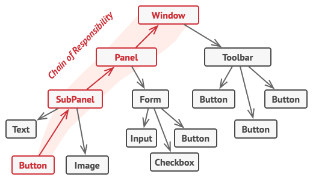

#Chain of Responsibility

Chain of Responsibility is a behavioral design pattern that lets you pass requests along a chain of handlers. Upon receiving a request, each handler decides either to process the request or to pass it to the next handler in the chain.

##Problem
Imagine that you’re working on an online ordering system. You want to restrict access to the system so only authenticated users can create orders. Also, users who have administrative permissions must have full access to all orders.

After a bit of planning, you realized that these checks must be performed sequentially. The application can attempt to authenticate a user to the system whenever it receives a request that contains the user’s credentials. However, if those credentials aren’t correct and authentication fails, there’s no reason to proceed with any other checks.

During the next few months, you implemented several more of those sequential checks.

- One of your colleagues suggested that it’s unsafe to pass raw data straight to the ordering system. So you added an extra validation step to sanitize the data in a request.

- Later, somebody noticed that the system is vulnerable to brute force password cracking. To negate this, you promptly added a check that filters repeated failed requests coming from the same IP address.

- Someone else suggested that you could speed up the system by returning cached results on repeated requests containing the same data. Hence, you added another check which lets the request pass through to the system only if there’s no suitable cached response.

The code of the checks, which had already looked like a mess, became more and more bloated as you added each new feature. Changing one check sometimes affected the others. Worst of all, when you tried to reuse the checks to protect other components of the system, you had to duplicate some of the code since those components required some of the checks, but not all of them.

The system became very hard to comprehend and expensive to maintain. You struggled with the code for a while, until one day you decided to refactor the whole thing.

##Solution
Like many other behavioral design patterns, the Chain of Responsibility relies on transforming particular behaviors into stand-alone objects called handlers. In our case, each check should be extracted to its own class with a single method that performs the check. The request, along with its data, is passed to this method as an argument.

The pattern suggests that you link these handlers into a chain. Each linked handler has a field for storing a reference to the next handler in the chain. In addition to processing a request, handlers pass the request further along the chain. The request travels along the chain until all handlers have had a chance to process it.

Here’s the best part: a handler can decide not to pass the request further down the chain and effectively stop any further processing.

In our example with ordering systems, a handler performs the processing and then decides whether to pass the request further down the chain. Assuming the request contains the right data, all the handlers can execute their primary behavior, whether it’s authentication checks or caching.

However, there’s a slightly different approach (and it’s a bit more canonical) in which, upon receiving a request, a handler decides whether it can process it. If it can, it doesn’t pass the request any further. So it’s either only one handler that processes the request or none at all. This approach is very common when dealing with events in stacks of elements within a graphical user interface.

For instance, when a user clicks a button, the event propagates through the chain of GUI elements that starts with the button, goes along its containers (like forms or panels), and ends up with the main application window. The event is processed by the first element in the chain that’s capable of handling it. This example is also noteworthy because it shows that a chain can always be extracted from an object tree.

It’s crucial that all handler classes implement the same interface. Each concrete handler should only care about the following one having the execute method. This way you can compose chains at runtime, using various handlers without coupling your code to their concrete classes.

##Structure

- The Handler declares the interface, common for all concrete handlers. It usually contains just a single method for handling requests, but sometimes it may also have another method for setting the next handler on the chain.

- The Base Handler is an optional class where you can put the boilerplate code that’s common to all handler classes.

    Usually, this class defines a field for storing a reference to the next handler. The clients can build a chain by passing a handler to the constructor or setter of the previous handler. The class may also implement the default handling behavior: it can pass execution to the next handler after checking for its existence.

- Concrete Handlers contain the actual code for processing requests. Upon receiving a request, each handler must decide whether to process it and, additionally, whether to pass it along the chain.

- Handlers are usually self-contained and immutable, accepting all necessary data just once via the constructor.

- The Client may compose chains just once or compose them dynamically, depending on the application’s logic. Note that a request can be sent to any handler in the chain—it doesn’t have to be the first one.

##Applicability

**Use the Chain of Responsibility pattern when your program is expected to process different kinds of requests in various ways, but the exact types of requests and their sequences are unknown beforehand.**

The pattern lets you link several handlers into one chain and, upon receiving a request, “ask” each handler whether it can process it. This way all handlers get a chance to process the request.

**Use the pattern when it’s essential to execute several handlers in a particular order.**

Since you can link the handlers in the chain in any order, all requests will get through the chain exactly as you planned.

**Use the CoR pattern when the set of handlers and their order are supposed to change at runtime.**

If you provide setters for a reference field inside the handler classes, you’ll be able to insert, remove or reorder handlers dynamically.

## Pros and Cons

:heavy_check_mark: You can control the order of request handling.
:heavy_check_mark: Single Responsibility Principle. You can decouple classes that invoke operations from classes that perform operations.
:heavy_check_mark: Open/Closed Principle. You can introduce new handlers into the app without breaking the existing client code.
:x: Some requests may end up unhandled.

##Usage of the pattern in Java

Usage examples :

The Chain of Responsibility pattern isn’t a frequent guest in a Java program since it’s only relevant when code operates with chains of objects.

One of the most popular use cases for the pattern is bubbling events to the parent components in GUI classes. Another notable use case is sequential access filters.

Here are some examples of the pattern in core Java libraries:

- javax.servlet.Filter#doFilter()
- java.util.logging.Logger#log()

##Identification: 
The pattern is recognizable by behavioral methods of one group of objects that indirectly call the same methods in other objects, while all the objects follow the common interface.