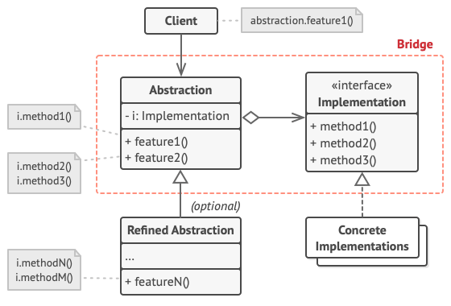

#Bridge pattern

Bridge is a structural design pattern that lets you split a large class or a set of closely related classes into two separate hierarchies **abstraction**  and **implementation**, which can be developed independently of each other.

##Problem

Say you have a geometric Shape class with a pair of subclasses:
**Circle** and **Square**.
You want to extend this class hierarchy to incorporate colors,
so you plan to create **Red** and **Blue** shape subclasses.

However, since you already have two subclasses,
you’ll need to create four class combinations such as
**BlueCircle** and **RedSquare**.

Adding new shape types and colors to the hierarchy will grow it exponentially.

For example, to add a triangle shape you’d need to introduce two subclasses, one for each color.

And after that, adding a new color would require creating three subclasses, one for each shape type. The further we go, the worse it becomes.

##Solution

This problem occurs because we’re trying to extend the shape classes in two independent dimensions: by **form** and by **color**.

That’s a very common issue with class inheritance.

The Bridge pattern attempts to solve this problem by switching from inheritance to the **object composition**. What this means is that you extract one of the dimensions into a separate class hierarchy, so that the original classes will reference an object of the new hierarchy, instead of having all of its state and behaviors within one class.

##Structure

- The Abstraction provides high-level control logic. It relies on the implementation object to do the actual low-level work.
- The Implementation declares the interface that’s common for all concrete implementations. An abstraction can only communicate with an implementation object via methods that are declared here.
- The abstraction may list the same methods as the implementation, but usually the abstraction declares some complex behaviors that rely on a wide variety of primitive operations declared by the implementation.
- Concrete Implementations contain platform-specific code.
- Refined Abstractions provide variants of control logic. Like their parent, they work with different implementations via the general implementation interface.
- Usually, the Client is only interested in working with the abstraction. However, it’s the client’s job to link the abstraction object with one of the implementation objects.

##Usage of the pattern in Java

The Bridge pattern is especially useful when dealing with cross-platform apps, supporting multiple types of database servers or working with several API providers of a certain kind (for example, cloud platforms, social networks, etc.)

**Identification:** Bridge can be recognized by a clear distinction between some controlling entity and several different platforms that it relies on.

##Applicability

- Use the Bridge pattern when you want to divide and organize a monolithic class that has several variants of some functionality (for example, if the class can work with various database servers).
- Use the pattern when you need to extend a class in several orthogonal (independent) dimensions.
- Use the Bridge if you need to be able to switch implementations at runtime.

##Pros and Cons
:heavy_check_mark: Vous pouvez créer des classes et des applications multiplateformes.
:heavy_check_mark: Le code client manipule des abstractions de haut niveau. Il n’est pas dépendant des détails de la plateforme.
:heavy_check_mark: Principe ouvert/fermé. Vous pouvez introduire de nouvelles abstractions et implémentations indépendamment les unes des autres.
:heavy_check_mark: Principe de responsabilité unique. Vous pouvez vous concentrer sur la logique de haut niveau dans l’abstraction, et sur les détails de la plateforme dans l’implémentation.
:x: Le code va devenir plus compliqué si vous introduisez ce patron dans une classe très cohésive.
