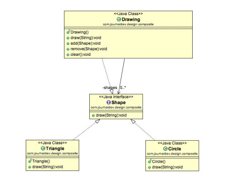
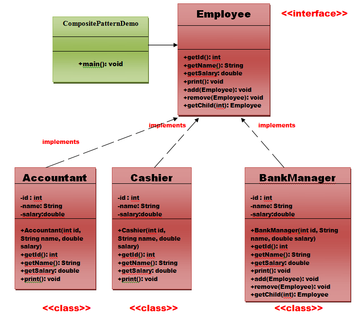

#Composite

Composite is a structural design pattern that lets you compose objects into **tree structures** and then work with these structures as if they were individual objects.

##Problem

Using the Composite pattern makes sense only when the core model of your app can be represented as a tree.
 
For example, imagine that you have two types of objects:
Products and Boxes.
 
A Box can contain several Products as well as a number of smaller Boxes.
 
These little Boxes can also hold some Products or even smaller Boxes, and so on.
 
Say you decide to create an ordering system that uses these classes. Orders could contain simple products without any wrapping, as well as boxes stuffed with products...and other boxes.
 
How would you determine the total price of such an order?

##Solution

The Composite pattern suggests that you work with Products and Boxes through a common interface which declares a method for calculating the total price.
 
How would this method work?
 
For a product, it’d simply return the product’s price.  
For a box, it’d go over each item the box contains, ask its price and then return a total for this box.
 
If one of these items were a smaller box, that box would also start going over its contents and so on, until the prices of all inner components were calculated.
 
A box could even add some extra cost to the final price, such as packaging cost.
 
The Composite pattern lets you run a behavior recursively over all components of an object tree.

The greatest benefit of this approach is that you don’t need to care about the concrete classes of objects that compose the tree.
 
You don’t need to know whether an object is a simple product or a sophisticated box. 
You can treat them all the same via the common interface. When you call a method, the objects themselves pass the request down the tree.

##Structure

- The Component interface describes operations that are common to both simple and complex elements of the tree.
- The Leaf is a basic element of a tree that doesn’t have sub-elements. Usually, leaf components end up doing most of the real work, since they don’t have anyone to delegate the work to.
- The Container (aka composite) is an element that has sub-elements: leaves or other containers. A container doesn’t know the concrete classes of its children. It works with all sub-elements only via the component interface. Upon receiving a request, a container delegates the work to its sub-elements, processes intermediate results and then returns the final result to the client.
- The Client works with all elements through the component interface. As a result, the client can work in the same way with both simple or complex elements of the tree.

##Applicability
####Use the Composite pattern when you have to implement a tree-like object structure.
The Composite pattern provides you with two basic element types that share a common interface: simple leaves and complex containers. A container can be composed of both leaves and other containers. This lets you construct a nested recursive object structure that resembles a tree.
####Use the pattern when you want the client code to treat both simple and complex elements uniformly.
All elements defined by the Composite pattern share a common interface. Using this interface, the client doesn’t have to worry about the concrete class of the objects it works with.

## Pros and Cons

:heavy_check_mark: You can work with complex tree structures more conveniently: use polymorphism and recursion to your advantage.
:heavy_check_mark: Open/Closed Principle. You can introduce new element types into the app without breaking the existing code, which now works with the object tree.
:x: It might be difficult to provide a common interface for classes whose functionality differs too much. In certain scenarios, you’d need to overgeneralize the component interface, making it harder to comprehend.

##Example

Example Employee

