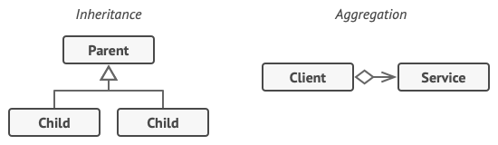
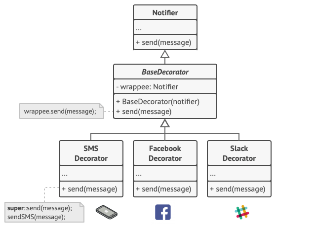

#Decorator
Decorator is a structural design pattern that lets you attach new behaviors to objects by placing these objects inside special wrapper objects that contain the behaviors.

#Problem
Imagine that you’re working on a notification library which lets other programs notify their users about important events.

The initial version of the library was based on the Notifier class that had only a few fields, a constructor and a single send method. The method could accept a message argument from a client and send the message to a list of emails that were passed to the notifier via its constructor. A third-party app which acted as a client was supposed to create and configure the notifier object once, and then use it each time something important happened.

At some point, you realize that users of the library expect more than just email notifications. Many of them would like to receive an SMS about critical issues. Others would like to be notified on Facebook and, of course, the corporate users would love to get Slack notifications.

How hard can that be? You extended the Notifier class and put the additional notification methods into new subclasses. Now the client was supposed to instantiate the desired notification class and use it for all further notifications.

But then someone reasonably asked you, “Why can’t you use several notification types at once? If your house is on fire, you’d probably want to be informed through every channel.”

You tried to address that problem by creating special subclasses which combined several notification methods within one class. However, it quickly became apparent that this approach would bloat the code immensely, not only the library code but the client code as well.

You have to find some other way to structure notifications classes so that their number won’t accidentally break some Guinness record.

#Solution
Extending a class is the first thing that comes to mind when you need to alter an object’s behavior. However, inheritance has several serious caveats that you need to be aware of.

Inheritance is static. You can’t alter the behavior of an existing object at runtime. You can only replace the whole object with another one that’s created from a different subclass.
Subclasses can have just one parent class. In most languages, inheritance doesn’t let a class inherit behaviors of multiple classes at the same time.
One of the ways to overcome these caveats is by using Aggregation or Composition  instead of Inheritance. Both of the alternatives work almost the same way: one object has a reference to another and delegates it some work, whereas with inheritance, the object itself is able to do that work, inheriting the behavior from its superclass.

With this new approach you can easily substitute the linked “helper” object with another, changing the behavior of the container at runtime. An object can use the behavior of various classes, having references to multiple objects and delegating them all kinds of work. Aggregation/composition is the key principle behind many design patterns, including Decorator. On that note, let’s return to the pattern discussion.

Wrapper” is the alternative nickname for the Decorator pattern that clearly expresses the main idea of the pattern. A wrapper is an object that can be linked with some target object. The wrapper contains the same set of methods as the target and delegates to it all requests it receives. However, the wrapper may alter the result by doing something either before or after it passes the request to the target.

When does a simple wrapper become the real decorator? As I mentioned, the wrapper implements the same interface as the wrapped object. That’s why from the client’s perspective these objects are identical. Make the wrapper’s reference field accept any object that follows that interface. This will let you cover an object in multiple wrappers, adding the combined behavior of all the wrappers to it.

In our notifications example, let’s leave the simple email notification behavior inside the base Notifier class, but turn all other notification methods into decorators.

The client code would need to wrap a basic notifier object into a set of decorators that match the client’s preferences. The resulting objects will be structured as a stack.

The last decorator in the stack would be the object that the client actually works with. Since all decorators implement the same interface as the base notifier, the rest of the client code won’t care whether it works with the “pure” notifier object or the decorated one.

##Structure

- The Component declares the common interface for both wrappers and wrapped objects.
- Concrete Component is a class of objects being wrapped. It defines the basic behavior, which can be altered by decorators.
- The Base Decorator class has a field for referencing a wrapped object. The field’s type should be declared as the component interface so it can contain both concrete components and decorators. The base decorator delegates all operations to the wrapped object.
- Concrete Decorators define extra behaviors that can be added to components dynamically. Concrete decorators override methods of the base decorator and execute their behavior either before or after calling the parent method.
- The Client can wrap components in multiple layers of decorators, as long as it works with all objects via the component interface.

##Applicability

**Use the Decorator pattern when you need to be able to assign extra behaviors to objects at runtime without breaking the code that uses these objects.**
>The Decorator lets you structure your business logic into layers, create a decorator for each layer and compose objects with various combinations of this logic at runtime. The client code can treat all these objects in the same way, since they all follow a common interface.

**Use the pattern when it’s awkward or not possible to extend an object’s behavior using inheritance.**
>Many programming languages have the final keyword that can be used to prevent further extension of a class. For a final class, the only way to reuse the existing behavior would be to wrap the class with your own wrapper, using the Decorator pattern.

## How to Implement
- Make sure your business domain can be represented as a primary component with multiple optional layers over it.
- Figure out what methods are common to both the primary component and the optional layers. Create a component interface and declare those methods there.
- Create a concrete component class and define the base behavior in it.
- Make sure your business domain can be represented as a primary component with multiple optional layers over it.
- Figure out what methods are common to both the primary component and the optional layers. Create a component interface and declare those methods there.
- Create a concrete component class and define the base behavior in it.
- Create a base decorator class. It should have a field for storing a reference to a wrapped object. The field should be declared with the component interface type to allow linking to concrete components as well as decorators. The base decorator must delegate all work to the wrapped object.
- Make sure all classes implement the component interface.
- Create concrete decorators by extending them from the base decorator. A concrete decorator must execute its behavior before or after the call to the parent method (which always delegates to the wrapped object).
- The client code must be responsible for creating decorators and composing them in the way the client needs.
- Create a base decorator class. It should have a field for storing a reference to a wrapped object. The field should be declared with the component interface type to allow linking to concrete components as well as decorators. The base decorator must delegate all work to the wrapped object.
- Make sure all classes implement the component interface.
- Create concrete decorators by extending them from the base decorator. A concrete decorator must execute its behavior before or after the call to the parent method (which always delegates to the wrapped object).
- The client code must be responsible for creating decorators and composing them in the way the client needs.

## Pros and Cons
:heavy_check_mark: You can extend an object’s behavior without making a new subclass.
:heavy_check_mark: You can add or remove responsibilities from an object at runtime.
:heavy_check_mark: You can combine several behaviors by wrapping an object into multiple decorators.
:heavy_check_mark: Single Responsibility Principle. You can divide a monolithic class that implements many possible variants of behavior into several smaller classes.
:x: It’s hard to remove a specific wrapper from the wrappers stack.
:x: It’s hard to implement a decorator in such a way that its behavior doesn’t depend on the order in the decorators stack.
:x: The initial configuration code of layers might look pretty ugly.
